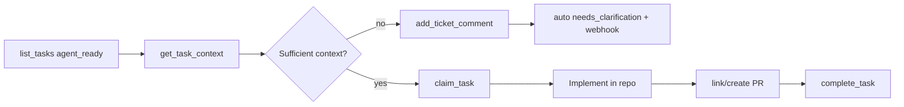

# Agent loop (MCP)

How an external agent (Claude Desktop, Cursor, cron + SDK) should pick up work on your instance: list → review brief → claim or ask for clarification → implement → PR → complete.

**Prerequisites:** A running instance (see [deploy/README.md](./deploy/README.md)), at least one **linked repository**, and MCP configured in your client.

---

## 1. Put a ticket in Agent Ready

Agents only **claim** from **`agent_ready`**. Inbox drafts are intentionally blocked.

### UI (recommended)

1. Sign in → **Repositories** → connect a repo for your project.
2. On the board **Intake** form, fill **all** fields (title, description, acceptance criteria, business context, expected outcome, repository).
3. Click **Add to Agent Ready** (not Inbox).

### MCP

**Multiple projects on one instance:** call `aikanban_list_projects`, then `aikanban_get_project` with a `projectSlug`, and pass that slug on every `aikanban_list_tasks` / `aikanban_create_task` call. If an admin set a **default project** in Agent settings, you can omit `projectSlug` when the instance has only that default (or a single project).

```text
aikanban_list_projects
aikanban_get_project({ "projectSlug": "platform" })
```

Then (use `repositoryId` from the Repositories UI or API):

```json
aikanban_create_task({
  "projectSlug": "platform",
  "title": "Short title",
  "description": "What to do",
  "acceptanceCriteria": "Done when …",
  "businessContext": "Why it matters",
  "expectedOutcome": "Expected result",
  "repositoryId": "<uuid>",
  "intakeMode": "strict"
})
```

Confirm the queue:

```text
aikanban_list_tasks({ "status": "agent_ready" })
```

| Symptom | Cause |
|---------|--------|
| Ticket stays in Inbox / low readiness | Missing fields or no repository |
| `list_tasks` agent_ready empty | No strict intake ticket yet |
| Claim fails | Ticket not in `agent_ready` |

---

## 2. Install MCP in Claude Desktop or Cursor

1. Open your instance → **Settings** → **Agent integration (MCP)** → **Copy config** (Claude or Cursor).
2. Paste into the client config:
   - **Claude Desktop:** `~/Library/Application Support/Claude/claude_desktop_config.json` → `mcpServers`
   - **Cursor:** Settings → MCP, or project `.cursor/mcp.json`
3. If the server has `AIKANBAN_API_TOKEN` set (Coolify env), replace `YOUR_AIKANBAN_API_TOKEN` in the copied JSON with that value — **required for write tools** (claim, create, comments, status changes). Restart the client after editing.
4. Use the **HTTP** MCP URL if your host uses sslip.io and HTTPS shows certificate warnings (e.g. `http://ai-kanban.<ip>.sslip.io/mcp`).

Smoke test from a machine with the repo cloned:

```bash
AIKANBAN_MCP_URL=https://your-host/mcp \
AIKANBAN_API_TOKEN=your-token \
node scripts/mcp-smoke.mjs --call
```

---

## 3. Tool sequence (happy path)



| Step | Tool | Notes |
|------|------|--------|
| 1 | `aikanban_list_tasks` | Filter `status: "agent_ready"`; response includes a **list** directive |
| 2 | `aikanban_get_task_context` | `taskRef` = key like `D-2` or UUID; includes **agentDirective** for current status |
| 3a | Review | For **agent_ready**: mandatory **pre_execution_review** — do not claim until review passes |
| 3b | Clarify | `aikanban_add_ticket_comment` with `kind: "clarification_request"` — server moves ticket to `needs_clarification` and notifies the author (webhook if configured) |
| 4 | `aikanban_claim_task` | `agentId` string (e.g. `claude-desktop`); only from `agent_ready` → `running` |
| 5 | Work | Use brief repository path / URL; follow acceptance criteria |
| 6 | PR | `aikanban_create_pull_request` or `aikanban_link_pull_request` |
| 7 | Done | `aikanban_complete_task` (optional summary) |

Directives are returned in every relevant MCP response as markdown (`## AI Kanban — …`) and JSON (`agentDirective`). They guide the agent; **claim** is enforced server-side (`agent_ready` only).

Admins can override prompt text under **Settings → Agent workflow prompts** (stored in `instance_settings.agent_directive_overrides`). Defaults live in `packages/agent-protocol/src/directives/templates/`.

---

## 4. Starter prompt (paste into Claude)

```text
You are connected to AI Kanban MCP. Run the agent loop on my instance:

1. Call aikanban_list_tasks with status "agent_ready".
2. If empty, stop and tell me to create an Agent Ready ticket in the UI.
3. Pick the first ticket. Call aikanban_get_task_context for its taskRef.
4. Read the agentDirective in the response and follow it exactly.
5. If context is insufficient: aikanban_add_ticket_comment (kind clarification_request) only — do NOT claim.
6. If context is sufficient: aikanban_claim_task with agentId "claude-desktop", then summarize the brief and what you would implement next (don't write code unless I ask).

Report each tool call and the directive phase you followed.
```

---

## 5. Verify on the board

| Agent action | Board |
|--------------|--------|
| Clarification | Column **Needs Clarification**; comment visible in ticket panel |
| Claim | Column **Running**; `claimedBy` set to your `agentId` |
| PR tools | **PR Open** when linked/created |
| Complete | **Done** |

Humans can also **Start work (claim)** from the ticket panel on `agent_ready` tickets (same transition as MCP claim).

---

## 6. CLI equivalent

```bash
export AIKANBAN_API_URL=https://your-host
export AIKANBAN_API_TOKEN=your-token   # if configured on server

pnpm cli list --status agent_ready
pnpm cli get-task D-2
pnpm cli claim D-2 --agent-id claude-desktop
pnpm cli complete D-2 --summary "Done"
```

See [AGENTS.md](../AGENTS.md) for full CLI and API reference.

---

## 7. Author notifications (clarification)

When an agent posts `clarification_request`, the server:

1. Moves the ticket to **Needs Clarification** (if it was Inbox, Agent Ready, or Ready for Planning).
2. Enqueues a `send_notification` job.

Set **`AIKANBAN_WEBHOOK_URL`** in server env to receive a JSON POST, for example:

```json
{
  "type": "clarification_request",
  "ticketKey": "D-2",
  "ticketId": "…",
  "ticketTitle": "…",
  "agentId": "claude-desktop",
  "commentBody": "…",
  "authorEmail": "you@company.com",
  "authorName": "…",
  "ticketUrl": "https://kanban.example.com/?ticket=D-2"
}
```

Without a webhook, payloads are logged to server stdout. Open the ticket URL on the board to reply in **Comments**.

In-app: use **Promote to Agent Ready** on a draft ticket once readiness shows green (or complete strict intake on the board).

---

## 8. Scheduling (outside the app)

The product does not run agents on a timer. Use your orchestrator to call MCP on a schedule, for example:

- Cron on a VM running `node scripts/mcp-smoke.mjs` or the CLI
- Cursor Automations / Cloud Agent with the same MCP URL and token
- Custom script using `@cursor/sdk` or raw JSON-RPC to `POST /mcp`

Typical poll: `list_tasks` (`agent_ready`) → for each ticket, spawn a job that runs the prompt in section 4.

---

## 9. Troubleshooting

| Problem | Fix |
|---------|-----|
| MCP 401 / write failures | Set `AIKANBAN_API_TOKEN` in server env and client Bearer header |
| Empty agent_ready | Complete strict intake + link repository |
| Directive says don't claim (Inbox) | Finish intake or create a new strict ticket |
| Claim rejected | Status must be `agent_ready` |
| PR tools fail | Sign in on web; connect provider on **Repositories** |
| Claude doesn't see tools | Restart client; check `Accept` header not required for HTTP transport — use URL from Settings |
